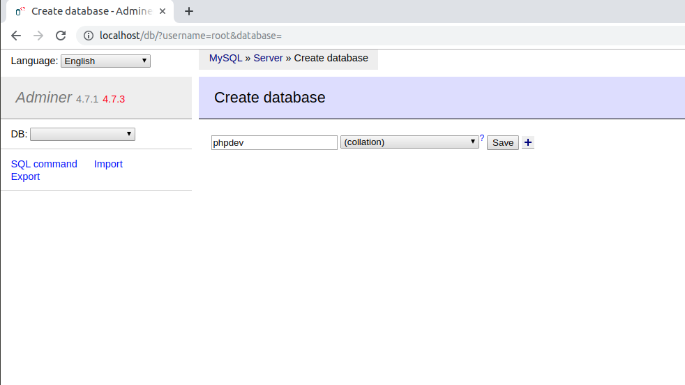
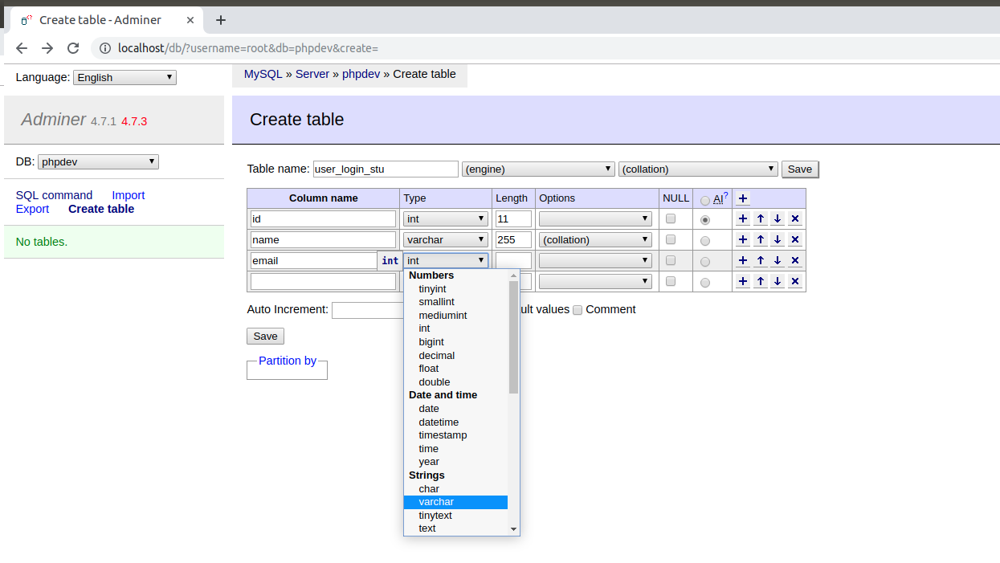
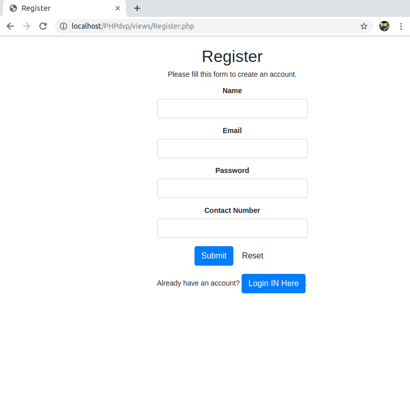
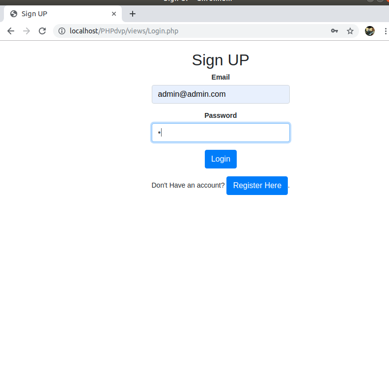
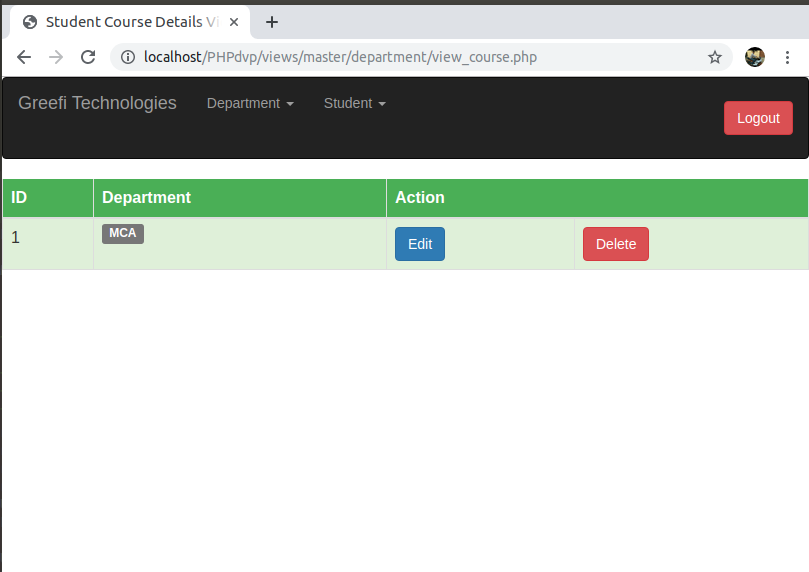
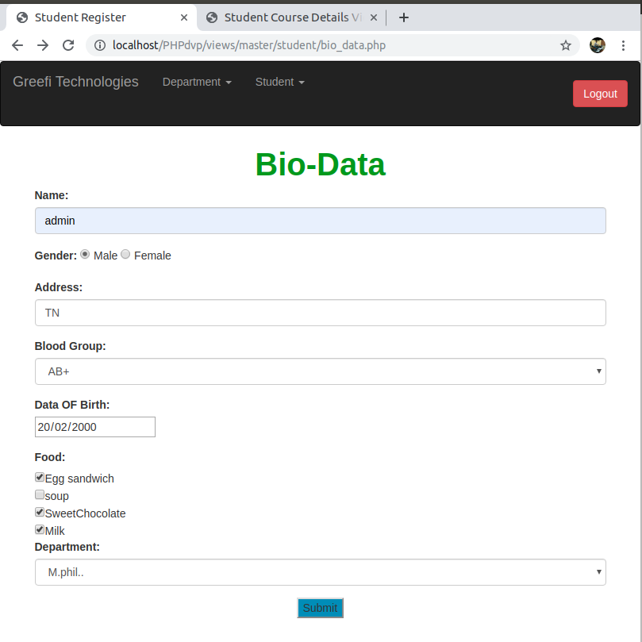
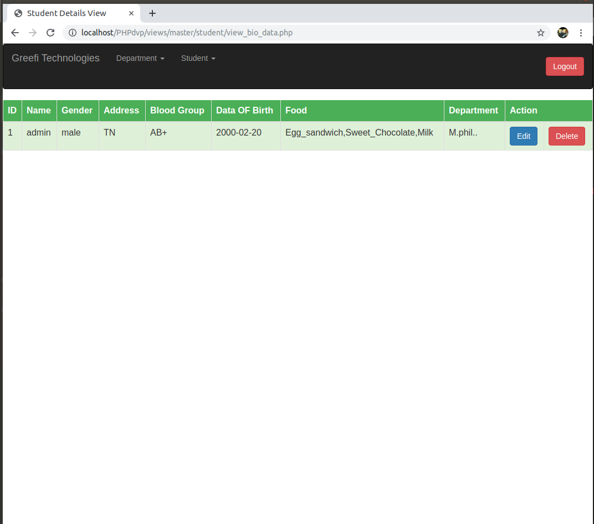

# PHPdvp_CRUD_Operation

Create new database name and field insert in create table name + column name and type

+

## Runing file Example http://localhost/PHPdvp/views/Register.php

##### Register/Login*
+

##### Home Page*

##### Add Department/View Department*
+

##### Add Student_Bio_Data/View Student_Bio_Data*
+

